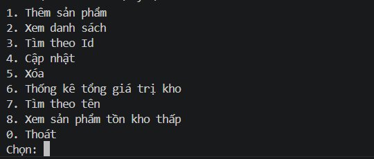
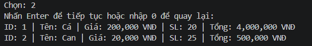

Giải thích được object khác class như thế nào?

Class như một khuôn mẫu  để tạo ra đối tượng  còn object là thực thể tạo ra từ class

 Ví dụ  Student  student1 = new Student ();

Day 2 em làm được tạo class tạo object tạo hàm  check lỗi và tính đống gói get set ,...

Day 3 em làm  các cấu linq  và curd sản phẩm

Day 4 em làm tạo   service , tạo inteface , implement interface ,  tạo helper cho input ,

## Chức năng

- Thêm sản phẩm
- Xem danh sách
- Tìm theo Id
- Cập nhật
- Xóa
- Thống kê tổng giá trị kho
- Tìm kiếm theo tên
- Lọc sản phẩm tồn kho thấp

## Flow

Start
↓

Hiển thị Menu

Chọn các chức năng

↓
Quay lại Menu

Video giải thích cấu trúc .

